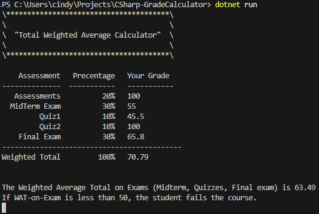

# CSharp Grade Calculator

A simple C# console application that calculates a student's **total weighted average** and determines if they pass or fail based on exam scores.

## 💡 Features

- Takes static inputs for assessment scores
- Displays total weighted average
- Calculates WAT-on-Exam (Weighted Average Total on Exams)
- Pass/fail logic based on minimum exam average

## 🛠 Technologies

- Language: C#
- Framework: .NET 8.0
- Type: Console Application

## 📸 Screenshot



## 🚀 How to Run

```bash
dotnet run
