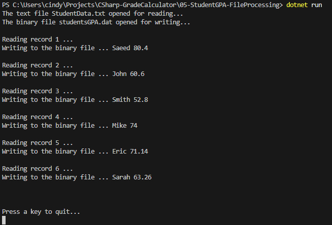

# 05 - Student GPA File Processing (Console App)

This C# console application reads student GPA data from a `.txt` file, processes it into structured objects, and writes the results to both a human-readable `.txt` report and a binary `.dat` file. It demonstrates **file I/O**, **object serialization**, and **data parsing** using a `Student` class.

---

## 🧠 Key Concepts Practiced
- Reading from a text file (StudentData.txt)
- Writing to a binary file (studentsGPA.dat)
- Data parsing and GPA calculation
- Class-based data encapsulation (Student.cs)
- Console-based step-by-step logging

---

## 🔧 Features

- Reads student records from `StudentData.txt`
- Parses each line into a `Student` object (Name, ID, GPA)
- Displays formatted table in the console
- Saves a summary report to a **text file** and **binary file**
- Demonstrates class encapsulation and list processing

---

## 🧱 Core Components

- `Student.cs`: Class to encapsulate student info and GPA
- `Program.cs`: Main logic for reading, parsing, displaying, and writing data
- `StudentData.txt`: Input file with student records
- `studentsGPA.dat`: Output binary file storing serialized results
- `Screenshot.png`: Sample console output

---

## 📁 Project Structure

/05-StudentGPA-FileProcessing/
├── 05-StudentGPA-FileProcessing.csproj     # Project file
├── Program.cs                              # Main logic for file processing
├── Student.cs                              # Student class for GPA handling
├── StudentData.txt                         # Input: student name + 5 grades
├── studentsGPA.dat                         # Output: binary file with name + GPA
├── Screenshot.png                          # Screenshot of console output
└── README.md                               # Project documentation

---

## 📝 Sample Input (`StudentData.txt`)

Saeed 89 90 78 65 80
John 56 45 34 78 90
Smith 20 56 78 65 45
Mike 45 89 78 60 98
Eric 80 90 89.7 70.5 25.5
Sarah 90 89.6 56.8 45.9 34

## 📤 Sample Output (Console)



## 💾 Binary Output
After the program runs, a file named studentsGPA.dat is created. It contains each student's name and GPA in binary format (not human-readable).

---

## 📘 What I Learned

- How to use StreamReader and BinaryWriter
- The basics of reading/writing structured data
- How to apply object-oriented principles to file processing tasks
- Real-world use cases for text-to-binary data transformation

---

## 🚀 How to Run

1. Clone this repository
2. Open terminal and navigate to this folder
3. Make sure you have .NET 6+ SDK installed
4. Run the app:

```bash
dotnet run
```

---

📚 This project is part of a progressive learning series in C# demonstrating fundamental skills in object-oriented programming and data processing.