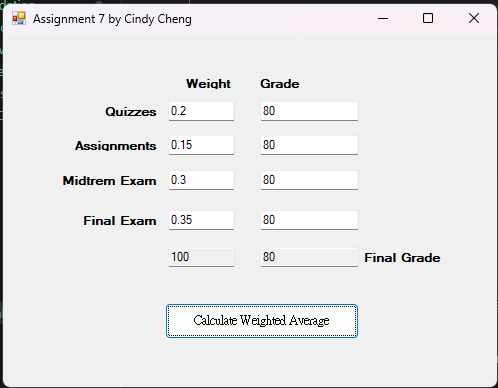

# 06 - Student GPA Calculator (Windows Forms)

This is a **GUI-based Student GPA Calculator** built using **Windows Forms (.NET Framework)** in C#. The application lets users input weights and grades for four assessment categories and calculates the final grade based on weighted average.

## 📦 Features

- **User-Friendly Interface**  
  Includes 9 labels, 8 textboxes, and 1 button for input and display.

- **Preloaded Default Weights**  
  Quizzes, Assignments, Midterm, and Final Exam weights are automatically set on form load.

- **Input Validation**  
  Checks for:
  - Valid numeric input (`TryParse`)
  - Value range (0–100)
  - Total weight = 1.0

- **Grade Calculation with 2D Array**  
  - A 4×2 array stores weights and grades
  - Loops used to compute total weight and final score

- **Clear Error Handling**  
  Alerts user with `MessageBox` on incorrect input

## 🖥️ UI Screenshot

## 🧠 What I Learned

- How to build Windows Forms GUI in C#
- Handling form lifecycle events (`Form_Load`, `Button_Click`)
- Parsing user input with validation and error messaging
- Using 2D arrays and loops for structured calculations
- Assigning calculated results to GUI elements dynamically

## 📁 Project Structure

06-StudentGPA-GUIFinalCalculator/
├── Properties/
│ ├── AssemblyInfo.cs
│ ├── Resources.Designer.cs
│ ├── Resources.resx
│ ├── Settings.Designer.cs
│ └── Settings.settings
├── App.config
├── Form1.cs
├── Form1.Designer.cs
├── Form1.resx
├── Program.cs
├── Screenshot.png
├── README.md
└── 06-StudentGPA-GUIFinalCalculator.csproj

## 🧰 Technologies Used

- **C#**
- **.NET Framework 4.7.2**
- **Windows Forms**
- Visual Studio / Visual Studio Code

## 📝 Note

This project was created as part of a C# programming course to demonstrate:
- GUI development with Windows Forms
- Use of arrays and control structures in real applications
